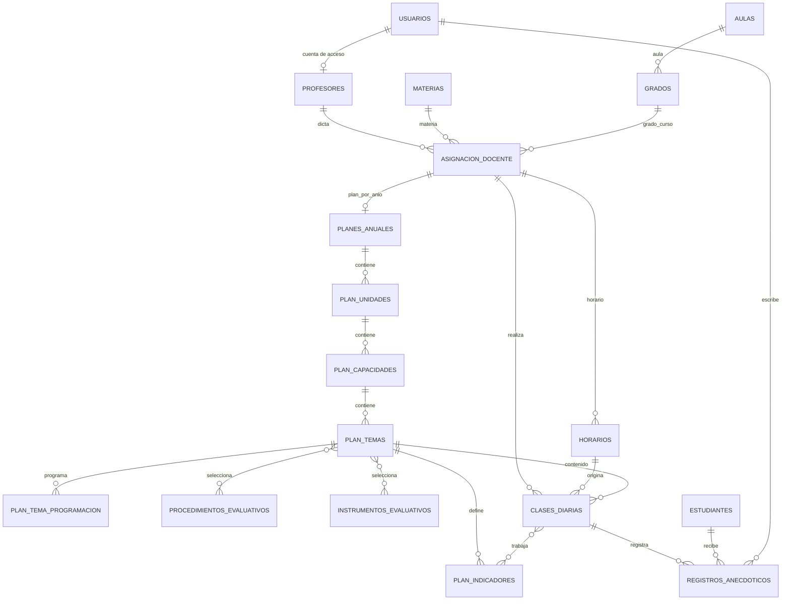

# Planificacion pedagogica e informes diarios

## Objetivo

El modulo permite definir y publicar el plan anual de cada asignacion existente, resolver automaticamente el contenido de una clase real desde una marca del profesor y generar un informe diario con asistencia y registro anecdotico. Mantiene PHP/PDO, MVC liviano, JavaScript nativo, Tailwind CDN y el tema visual de SISCO-EDU.

## Auditoria previa (31-08-2026)

- La aplicacion usa vistas en `mvc/views`, controladores livianos en `mvc/controllers`, clases PDO en `src/classes` y endpoints en `src/api`.
- No hay enrutador ni framework: las URLs apuntan directamente a vistas y endpoints PHP.
- La sesion guarda `id_usuario`, `usuario` y `rol`. Los roles reales son `SuperAdmin`, `Coordinador`, `Profesor` y `Administracion`.
- `asignacion_docente` ya contiene profesor, materia, grado, carga horaria y anio lectivo. El aula se obtiene desde `grados.id_aula`; no se duplicaron esos datos en el plan.
- `grados` es la unica entidad curso/grado. El informe muestra un unico campo **Grado/Curso**.
- `horarios` referencia asignacion, grado y aula, y soporta clases conjuntas. No se modifico esa implementacion.
- El Gateway vigente escribe marcas en `eventos_asistencia` mediante `src/api/Gateway/registrar_asistencia.php`. Las tablas historicas `asistencias_estudiantes` y `asistencias_profesores` siguen disponibles.
- No existe una tabla de calendario academico. La programacion se integra con el anio de la asignacion, la fecha y el dia/franja de `horarios`.
- No existia modulo de informes ni libreria PDF (Dompdf, mPDF, TCPDF, FPDF o equivalente). Se implemento HTML A4 con `@media print`, compatible con “Imprimir / Guardar como PDF” del navegador, sin dependencia nueva.
- No se cambio el protocolo LoRa ni el firmware ESP32.
- Antes del cambio: lint PHP completo correcto y prueba frontend 77/77.

### Brecha de ownership encontrada

La sesion identifica un usuario, pero `profesores` no estaba relacionado con `usuarios`. Comparar nombres o confiar en un `id_profesor` del navegador no seria seguro. La migracion agrega solamente `profesores.id_usuario`, nullable, unique y con FK a `usuarios`. El CRUD de profesores permite vincular una cuenta activa con rol `Profesor`. Los registros historicos quedan sin vincular y no se alteran.

## Arquitectura y relaciones



## Tablas nuevas

| Tabla | Funcion |
|---|---|
| `planes_anuales` | Cabecera unica por asignacion y anio; BORRADOR, PUBLICADO o ARCHIVADO. |
| `plan_unidades` | Unidades, proceso, horas, area transversal, metodologia y medios de verificacion. |
| `plan_capacidades` | Capacidades y proceso de desarrollo. |
| `plan_temas` | Temas/contenidos y horas. |
| `plan_indicadores` | Definicion original de indicadores. |
| `procedimientos_evaluativos` | Catalogo activo, almacenado en BD. |
| `instrumentos_evaluativos` | Catalogo activo, almacenado en BD. |
| `plan_tema_procedimientos` | Relacion muchos-a-muchos. |
| `plan_tema_instrumentos` | Relacion muchos-a-muchos. |
| `plan_tema_programacion` | Uno o varios rangos por tema. Fecha puntual = inicio y fin iguales. |
| `clases_diarias` | Clase real idempotente por asignacion, fecha y franja. Los FK pedagogicos son null si no hay contenido. |
| `clase_diaria_indicadores` | Snapshot de indicadores trabajados y estado de cumplimiento, separado de la definicion. |
| `registros_anecdoticos` | Una observacion por clase y estudiante; la asistencia historica es opcional. |
| `configuracion_informes` | Ruta del membrete activo y usuario que lo actualizo. |

Las FK de entidades maestras usan `RESTRICT`. `CASCADE` se limita a relaciones dependientes puras (selecciones del tema, programaciones, indicadores snapshot y registros de una clase). Las eliminaciones de unidad/capacidad/tema se realizan de forma explicita y transaccional, y se bloquean cuando una clase ya usa el contenido.

## Flujo de carga

1. Abrir **Planificacion pedagogica**.
2. Elegir una asignacion activa. Profesor, materia, grado/aula y anio se derivan del registro existente.
3. Crear el plan y abrir el editor.
4. Agregar unidades, capacidades, temas e indicadores de manera progresiva.
5. Elegir procedimientos e instrumentos desde catalogos de BD. Las opciones nuevas se crean en el mismo editor.
6. Programar cada tema con fechas puntuales o periodos. El backend valida fechas, anio y solapamientos con otros temas.
7. Publicar. Se exige al menos un tema que tenga indicador y programacion.

Solo `PUBLICADO` se usa para automatizacion. `ARCHIVADO` queda de solo lectura y no participa en nuevas clases.

## Marca del profesor y clase diaria

El payload y la autenticacion del Gateway no cambiaron. Despues de insertar el evento existente, el backend:

1. Resuelve `profesores.user_id_global`.
2. Busca horario activo en el aula, dia y franja (admite marca hasta 10 minutos antes).
3. Obtiene la asignacion y exige el mismo anio lectivo.
4. Busca un plan publicado y un rango que incluya la fecha.
5. Inserta o recupera `clases_diarias` con `ON DUPLICATE KEY` y la restriccion unica de clase.
6. Copia los indicadores del tema a `clase_diaria_indicadores`.

El evento y la resolucion se ejecutan en una transaccion. Si no hay horario, se conserva la marca pero no se inventa una clase. Si hay horario y no hay contenido, se crea la clase con FK pedagogicos null.

## Asistencia e informe

Los estudiantes esperados se obtienen por `estudiantes.id_grado = asignacion_docente.id_grado`, activos y ordenados por apellido/nombre. Un estudiante es **PRESENTE** si existe:

- un `eventos_asistencia` activo para su `user_id_global`, aula, fecha y ventana de clase; o
- una fila historica activa en `asistencias_estudiantes` con estado PRESENTE/TARDANZA dentro de la ventana.

Los demas esperados son **AUSENTE**. El ESP32 no envia ausentes y no se creo un sistema paralelo.

`registros_anecdoticos` se identifica por `(id_clase, id_estudiante)`. La referencia a `asistencias_estudiantes` es nullable: un ausente puede tener observacion. Guardar texto vacio elimina la observacion de esa pareja, no la clase ni la asistencia.

El informe presenta membrete, materia, profesor, Grado/Curso, fecha/horario, unidad, capacidad, tema, indicadores y la tabla de estudiantes. Si falta contenido, muestra **Sin contenido programado para esta fecha** y permite elegir un tema de un plan publicado.

## Membrete e impresion

**Administracion > Configuracion de informes** acepta PNG/JPG/JPEG de hasta 2 MB. Se validan error de carga, tamano, extension y MIME real con `finfo`. La BD guarda una ruta relativa; los archivos se escriben en `public/uploads/informes`. Los membretes anteriores se conservan como historial de archivos aunque su fila quede inactiva.

La vista A4 oculta sidebar, filtros y botones al imprimir. No se agrego una libreria PDF grande: el boton usa el dialogo nativo del navegador, que permite guardar PDF.

## Permisos

| Rol | Planes | Informes/observaciones | Membrete |
|---|---|---|---|
| Profesor | Lista, crea y edita solo asignaciones vinculadas a su cuenta. | Solo sus asignaciones/clases. | No. |
| Coordinador | Consulta y edita todos los planes e informes. | Todos. | No. |
| Administracion | Administracion pedagogica completa. | Todos. | Si. |
| SuperAdmin | Administracion completa. | Todos. | Si. |

Todos los endpoints nuevos validan sesion, rol, IDs y ownership en backend. Los errores al usuario no exponen stack traces.

## Endpoints

| Metodo | Endpoint | Uso |
|---|---|---|
| GET | `src/api/Planificacion/asignaciones.php` | Asignaciones permitidas. |
| GET/POST | `src/api/Planificacion/planes.php` | Listar/obtener, crear, actualizar y cambiar estado. |
| POST | `src/api/Planificacion/estructura.php` | Guardar, reordenar o eliminar unidades/capacidades/temas/indicadores; evaluacion M:N. |
| GET/POST | `src/api/Planificacion/catalogos.php` | Listar y crear procedimientos/instrumentos. |
| POST | `src/api/Planificacion/programacion.php` | Guardar/eliminar fechas y periodos. |
| POST | `src/api/Informes/clase_diaria.php` | Crear o recuperar manualmente una clase desde asignacion/fecha. |
| GET/POST | `src/api/Informes/informe_diario.php` | Buscar/obtener informe y asignar contenido autorizado. |
| GET | `src/api/Informes/temas_publicados.php` | Temas disponibles para correccion manual. |
| POST | `src/api/Informes/registro_anecdotico.php` | Upsert de observacion por clase/estudiante. |
| GET/POST | `src/api/Configuracion/configuracion_informes.php` | Consultar/subir membrete (Admin). |

## Instalacion y pruebas

La migracion es `database/migrations/20260831_planificacion_pedagogica.sql` y es aditiva/re-ejecutable para las tablas/columna previstas:

```powershell
C:\xampp\mysql\bin\mysql.exe -u root sisco_db -e "source database/migrations/20260831_planificacion_pedagogica.sql"
```

Prueba integral con datos temporales y limpieza:

```powershell
C:\xampp\php\php.exe test\test_planificacion_pedagogica.php
```

Regresion visual no destructiva:

```powershell
node test\admin_frontend_headless.js
```

## Decisiones y limites reales

- La aplicacion existente solo tenia un usuario SuperAdmin; antes de usar un login Profesor se debe crear esa cuenta y vincularla desde **Profesores > Cuenta de acceso**.
- La programacion distingue fecha/periodo, no hora dentro del mismo dia. Para que la seleccion automatica sea determinista se rechazan solapamientos entre temas diferentes del mismo plan. Varias fechas del mismo tema si son validas.
- Las clases conjuntas permiten compartir una franja entre grados con la misma materia. Con la opción explícita **Incluir materias distintas**, un mismo profesor puede vincular asignaciones de materias diferentes (por ejemplo, 9.º Matemática y 8.º Ética). El servidor exige sesión/CSRF, asignaciones activas del mismo profesor y año, una sola asignación por grado, aula libre y selección completa del grupo; cada horario conserva su materia, aula y asignación propia. Los conflictos no seleccionados siguen bloqueando la operación y cualquier fallo revierte todo el grupo.
- La creacion manual de clase elige el primer horario activo de la asignacion en la fecha. Las marcas biometricas, que son el flujo normal, resuelven la franja exacta. Si se necesita generar manualmente una segunda franja del mismo dia, el endpoint acepta `id_horario`, aunque la vista prioriza el flujo biometrico.
- No se incorporo calendario de feriados porque no existe una entidad equivalente en el esquema actual. Agregarlo debe ser una ampliacion posterior, no una tabla duplicada improvisada.
- Los endpoints CRUD historicos fuera de este modulo conservan su politica previa. Los endpoints nuevos aplican RBAC/ownership estricto.
